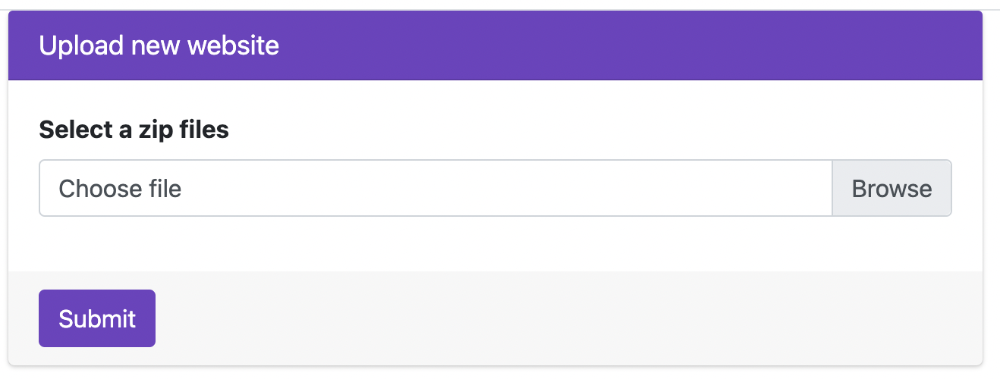
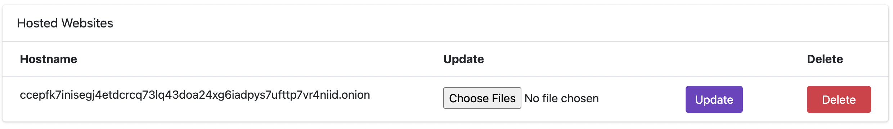

# Onion Farm


I made this project to make it easy for anyone to host a website on the Onion network using a simple web interface.

# How to use

```bash
docker run -p 3000:5000 ricardobchaves6/onion-farm:v1.0.0
```

Now just access your localhost on the chosen port, in my example it's `3000`. `0.0.0.0:3000`

# Interface

Your website needs to be in a zip file, and the root of your project needs to have an index.html. Upload your file and wait for the Onion address to appear on the list. Once the address is there, you can access it on any browser with access to the Onion network. It may take up to two minutes for the site to be accessible via the Onion network.





# Advanced Options

## Preserve Data

If you destroy your container, you will lose your website URL. To prevent this, you can use docker volumes.

```bash
docker run \
    -p 3000:5000 \
    -v $(pwd)/html/:/var/www/html/ \
    -v $(pwd)/http.d/:/etc/nginx/http.d/ \
    -v $(pwd)/torrc.d/:/etc/torrc.d/ \
    -v $(pwd)/tor/:/var/lib/tor/ \
    ricardobchaves6/onion-farm:v0.0.14-beta
```

## Auth

The default user is `admin` and the default password is `admin`.

You can change this using `ONION_FARM_USER` and `ONION_FARM_PASSWORD` variables.
